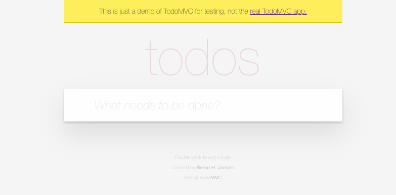
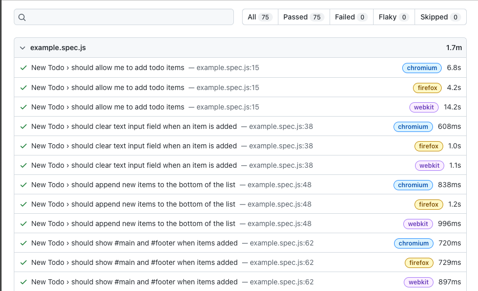
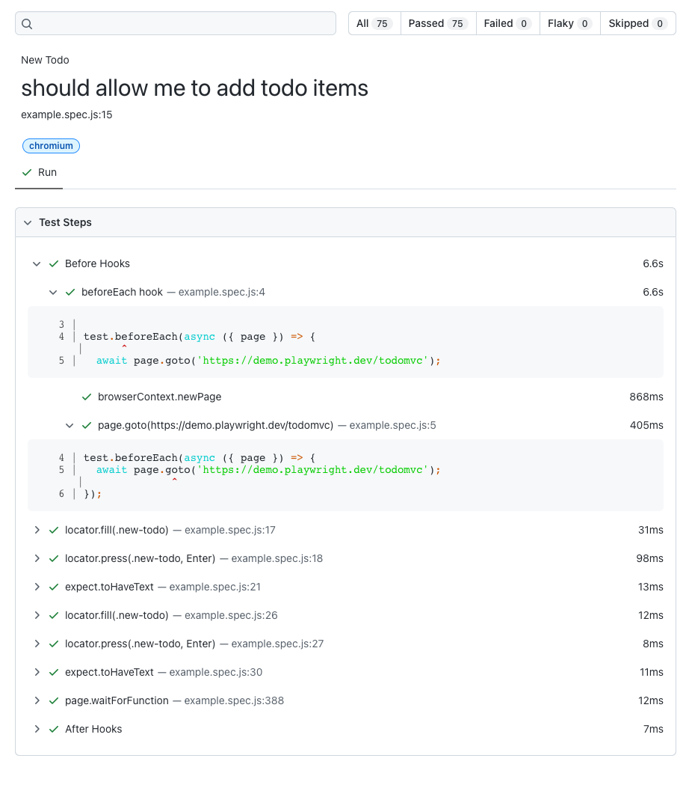
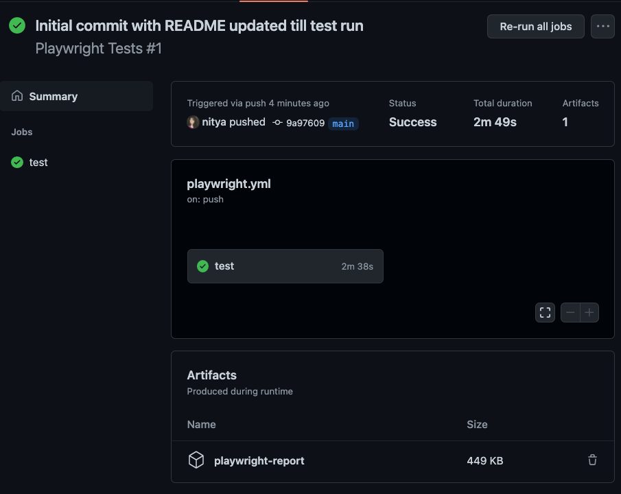
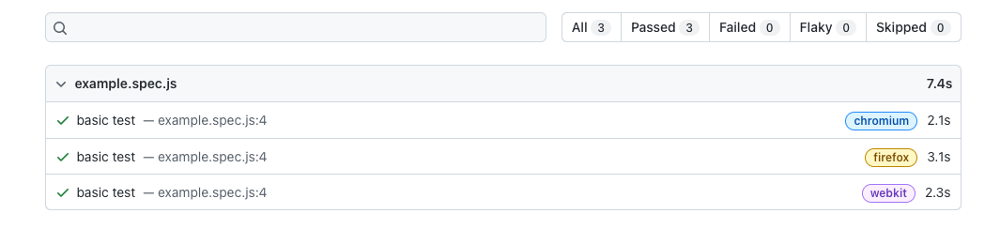
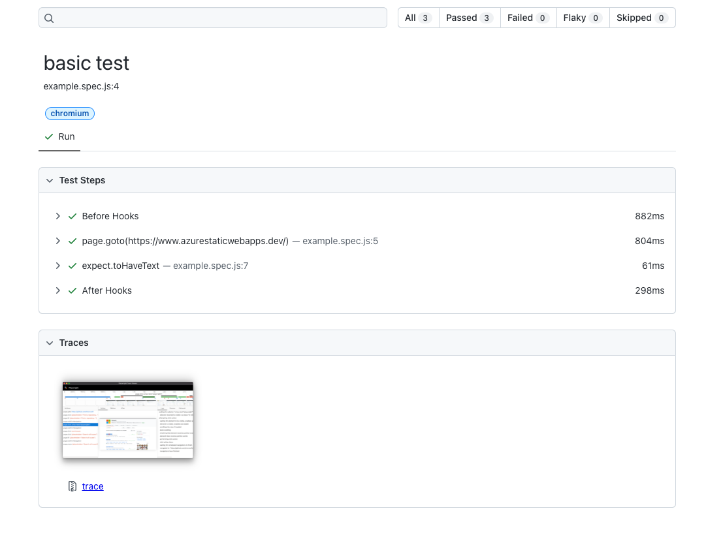
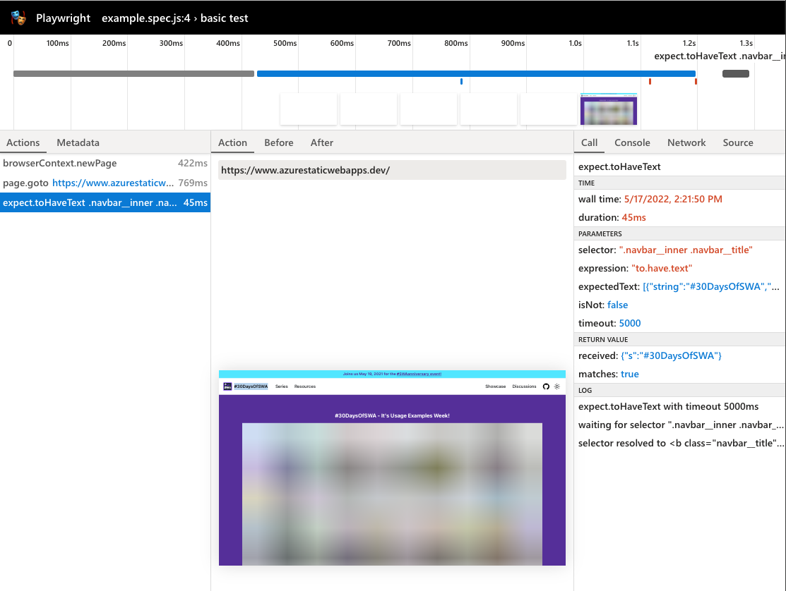

# Testing #30DaysOfSWA with Playwright Actions

## 1. What are we doing?

The final objective is to setup automated tests to support end-to-end testing of the deployed #30DaysOfSWA website at https://aka.ms/30DaysOfPWA

The initial objective is to document the usage of Playwright as the testing framework, following the [Getting Started](https://playwright.dev/docs/1.21/intro) tutorial as a quickstart, then refining the established test structure and scripts to meet requirements.

---

## 2. Where should my tests be?

Note that the #30DaysOfSWA site is built and deployed from [this source repository](https://github.com/staticwebdev/30DaysOfSWA). In a real-world application, we would be setting up the tests in the _same_ repo to automate testing on every push or commit to the source.

However, *this** repo is being used as a tutorial to explore Playwright capabilities - so writing it as a standalone project that tests only against the **deployed** SWA website.

---

## 3. How do I install Playwright?

There are three options:
 * [Using VS Code extension](https://playwright.dev/docs/1.21/intro#using-the-vs-code-extension) for default scaffold and config from IDE
 * [Using `npm init`](https://playwright.dev/docs/1.21/intro#using-init-command) for default scaffold and config at commandline
 * [Manually](https://playwright.dev/docs/1.21/intro#manually) for more granular control over process.

For now, I'm taking the second route.

```
npm init playwright@latest 
```

The command should kickstart the process by asking you to configure your preferences for programming language, testing folder location, and GitHub Actions integration. Here is what that looks like (output truncated for clarity)

```
Getting started with writing end-to-end tests with Playwright:
Initializing project in '.'
✔ Do you want to use TypeScript or JavaScript? · JavaScript
✔ Where to put your end-to-end tests? · tests
✔ Add a GitHub Actions workflow? (y/N) · true

Initializing NPM project (npm init -y)
Wrote to <pwd>/package.json:
...
...
Chromium 102.0.5005.40 (playwright build v1005) downloaded to <dirname>
Firefox 99.0.1 (playwright build v1323) downloaded to  <dirname>
Webkit 15.4 (playwright build v1641) downloaded to  <dirname>
...
...
Writing playwright.config.js.
Writing .github/workflows/playwright.yml.
Writing tests/example.spec.js.
Writing package.json.
✔ Success! Created a Playwright Test project at <pwd>
```

The installation then ends with some recommendations:

```
Inside that directory, you can run several commands:

  npx playwright test
    Runs the end-to-end tests.

  npx playwright test --project=chromium
    Runs the tests only on Desktop Chrome.

  npx playwright test example.spec.js
    Runs the tests in the specific file.

  npx playwright test --debug
    Runs the tests in debug mode.

We suggest that you begin by typing:

    npx playwright test

And check out the following files:
  - ./example.spec.js - Example end-to-end test
  - ./playwright.config.js - Playwright Test configuration

Visit https://playwright.dev/docs/intro for more information. ✨

Happy hacking! 🎭
```

---

## 4. What did the installation do?

 1. It installs the Playwright commandline tools in your local development environment. Let's validate by checking the installed version.

    ```
    $npx playwright --version
    Version 1.22.1
    ```

 2. It downloads and installs the three core browsers required for cross-platform testing: **Chromium, Firefox and WebKit**. Check the output to see which versions were installed. You can always use the manual option to [customize the browser installation](https://playwright.dev/docs/1.21/cli#install-browsers)

 3. It sets up the basic configuration files, dependencies and scripts required to run your end-to-end tests. Here's what that looks like (output cleaned up and annotated for clarity)

    ```
    $ ls 
    .git/
    .github/
        workflows/
            playwright.yml // Playwright actions
    .gitignore
    LICENSE                 
    node_modules/                   
    playwright.config.js  // Playwright config
    README.md               
    package-lock.json     
    tests                 
        example.spec.ts    // Playwright tests
    package.json          
    ```

---

## 5. What can I do with this?

Let's take the installation log's advice and run the default Playwright Test Runner on the default test script.

```
$npx playwright test
```

Here's what we see:

```
$ npx playwright test

Running 75 tests using 3 workers
[63/75] [webkit] › example.spec.js:227:3 › Editing › shoul
  Slow test file: [webkit] › example.spec.js (41s)
  Slow test file: [firefox] › example.spec.js (30s)
  Slow test file: [chromium] › example.spec.js (29s)
  Consider splitting slow test files to speed up parallel execution

  75 passed (41s)

To open last HTML report run:

  npx playwright show-report
```

What did this do? It ran the default (25) tests in the [example.spec.js](tests/example.spec.js) file on the (3) target browsers identified in the "projects" section of the [playwright.config.js](/playwright.config.js) file. Currently the test runner uses three workers - however you can [control parallelism and sharding](https://playwright.dev/docs/1.21/test-parallel) for efficiency.

The default test configuration and spec files are heavily annotated - helping you understand exactly what the test achieves, and how to configure the test run.

By default, tests are run against [this TODO MVC demo app](https://demo.playwright.dev/todomvc). 


In the later "Customize Tests" section, we'll take our first steps in customizing the default script to run against the [#30DaysOfSWA](https://www.azurestaticwebapps.dev/) site instead, and use the process to understand more about the testing process.

---

## 6. What does the Report Show?

You may have noticed that the execution of the test run ended with the following message:

```
To open last HTML report run:

  npx playwright show-report
```

This should launch the default browser open to `http://127.0.0.1:9323/` - showing an HTML-based report as shown below. 



We can immediately note a few things:
 * The report provides a summary of tests status (top)
 * It breaks down status for each test by browser, duration (performance)
 * It allows to dive into a given test for details.

For example, clicking on the first test takes us to this screen which breaks down the status and duration of each test action within that test.



---

## 7. What about those GitHub Actions?

That's right - the default scaffold sets up the `.github/workflow/playwright.yml` file for you. Let's take a peek inside:

```yaml
name: Playwright Tests
on:
  push:
    branches: [ main, master ]
  pull_request:
    branches: [ main, master ]
jobs:
  test:
    timeout-minutes: 60
    runs-on: ubuntu-latest
    steps:
    - uses: actions/checkout@v2
    - uses: actions/setup-node@v2
      with:
        node-version: '14.x'
    - name: Install dependencies
      run: npm ci
    - name: Install Playwright Browsers
      run: npx playwright install --with-deps
    - name: Run Playwright tests
      run: npx playwright test
    - uses: actions/upload-artifact@v2
      if: always()
      with:
        name: playwright-report
        path: playwright-report/
        retention-days: 30
```

We can see that this sets up a GitHub Action that installs dependencies and required browsers, then runs the test - and uploads the report as an artifact to your GitHub repo that is _retained for 30 days_.

Let's see this in action by committing the file. If you check the [Actions tab](https://github.com/fearlessly-dev/30daysofSWA-testing/actions) on your GitHub repo, you should see the workflow triggered by the most recent commit. When it completes you should see something like this:



Note: this may take a non-trivial amount of time on the initial tests given the number of browsers and tests run. Later on, we can customize the configuration to be more specific to our needs.


## 8. Viewing Actions-Generated Reports

**Notice the Artifacts section** - if you click on the `playwright-report` it should download a trace file (`playwright-report.zip`) to your local development devices. Want to see what this contains? 

Download and unzip it - it should contain a simple HTML file that you can open in a local browser, to see the same kind of report we saw earlier.


## 9. Let's Customize The Script 

Move the existing script to [examples.spec.js.orig](./tests/example.spec.js.orig) then create a new [examples.spec.js](./tests/example.spec.js) - and let's copy over the [First Test](https://playwright.dev/docs/1.21/intro#first-test) from the Playwright docs.

Customize it to navigate to your testing site (in my case `https://www.azurestaticwebapps.dev/`) and test using a valid selector. In my case, since both #30DaysOfSWA and Playwright.dev use the [Docusaurus](https://docusaurus.io) site generator, I can reuse the same test and just match it up to my title of `#30DaysOfSWA`

```
// @ts-check
const { test, expect } = require('@playwright/test');

test('basic test', async ({ page }) => {
  await page.goto('// @ts-check
const { test, expect } = require('@playwright/test');

test('basic test', async ({ page }) => {
  await page.goto('https://www.azurestaticwebapps.dev/');
  const title = page.locator('.navbar__inner .navbar__title');
  await expect(title).toHaveText('#30DaysOfSWA');
  const title = page.locator('.navbar__inner .navbar__title');
  await expect(title).toHaveText('#30DaysOfSWA');
});
```

Let's run it locally! But wait, we'll make one tiny tweak.

We'll go into the `playwright.config.js` file and change the `trace` property value from `on-first-retry` to `on`. What this does is turn on [Trace Viewer](https://playwright.dev/docs/1.21/trace-viewer) during the test run, giving us an incredibly more detailed trace log.

Just like before, let's run the test - and then look at the report.

```
npx playwright test
npx playwright show-report
```

## The Joys Of Trace Logs

Runs just like before - but wait, the report looks a bit different does it not?

> The HTML Report

Note that now we have just a single test running on all three browsers, and we get the same status and timing information.



Dive into one of those tests, and now we see something different - a _trace_ screenshot that seems to have more detail! Let's click on it!



Behold the power of Trace Viewer. This tool provides detailed information for profiling the performance, seeing screenshots and snapshots (before/after test action) to help you debug and audit your app better. 



Want to learn more about Trace Viewer? [Read this article on dev.to](https://dev.to/azure/004-tool-talk-hello-trace-viewer-2a61) and here's a handy visual guide. You can find a hi-res downloadable version [here](https://nitya.github.io/learn-playwright/004-trace-viewer/) that walks you through the many features.


> CONGRATULATIONS! 

You just setup a Playwright testing harness for testing your deployed Static Web App. Commit these changes to see the trace files show up in your artifacts.

> EXERCISE

Your turn. Study the [original](/tests/example.spec.js) test spec and see if you can understand how different test actions are created. Try adding a new test to your existing script and see how that works.

Feeling motivated? Try using [codegen](https://playwright.dev/docs/1.21/codegen) to have Playwright auto-generate tests for you based simply on your walkthrough of the default user experience on your website.

Now, we can start playing with the scripts to customize our test workflows more.


